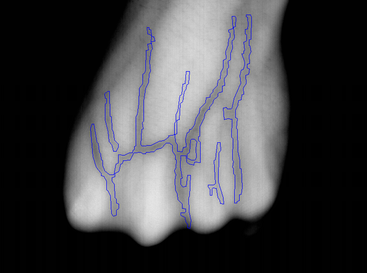
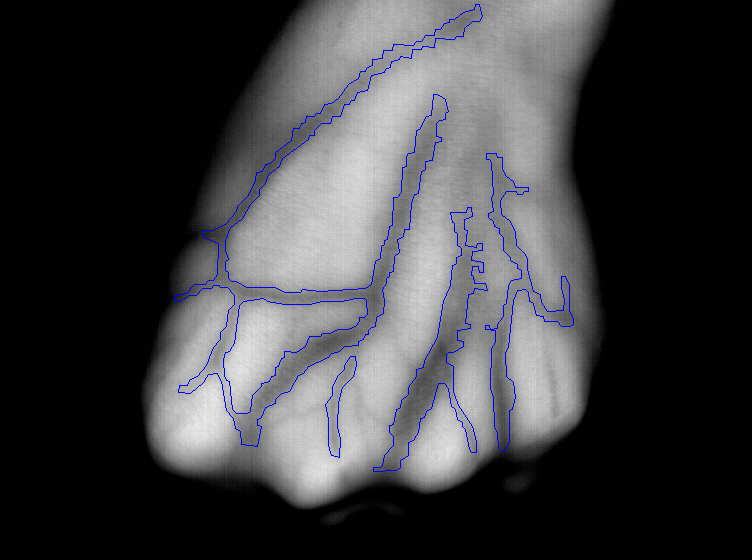
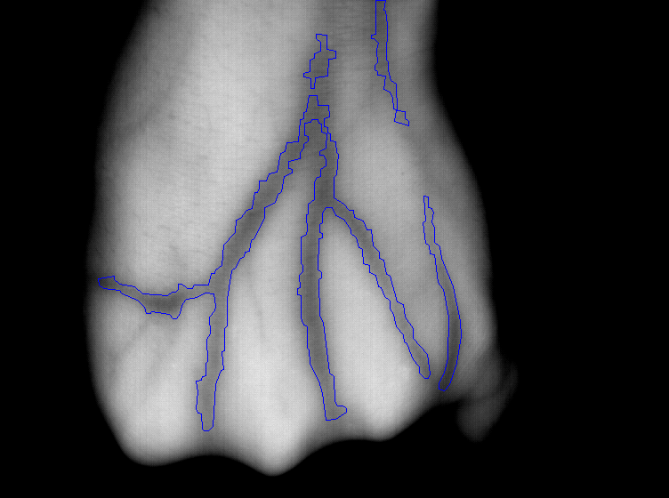
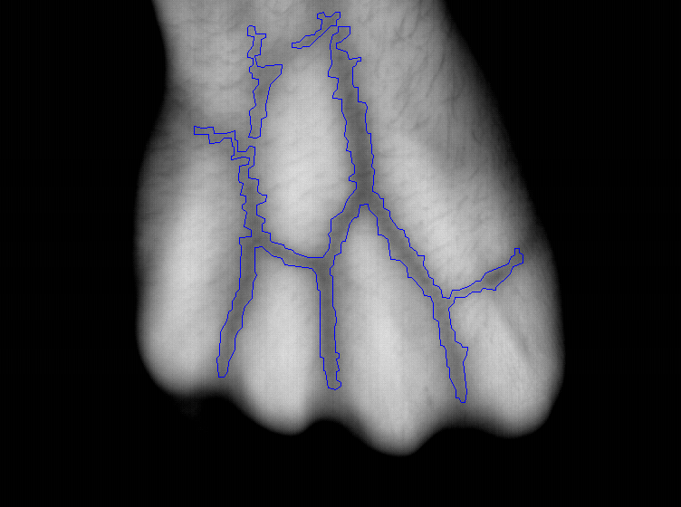
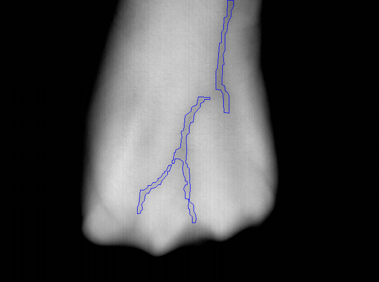
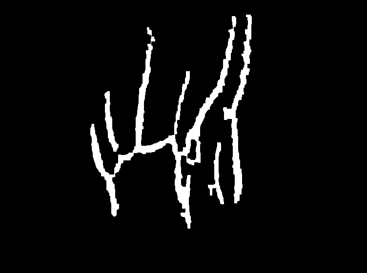
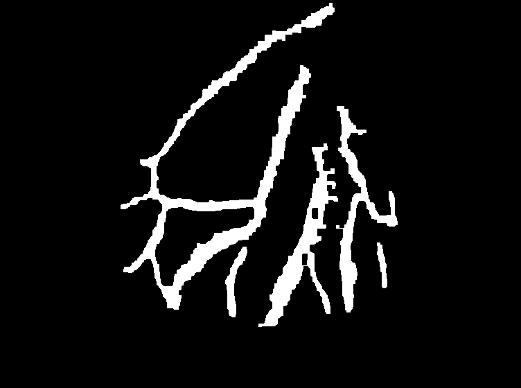
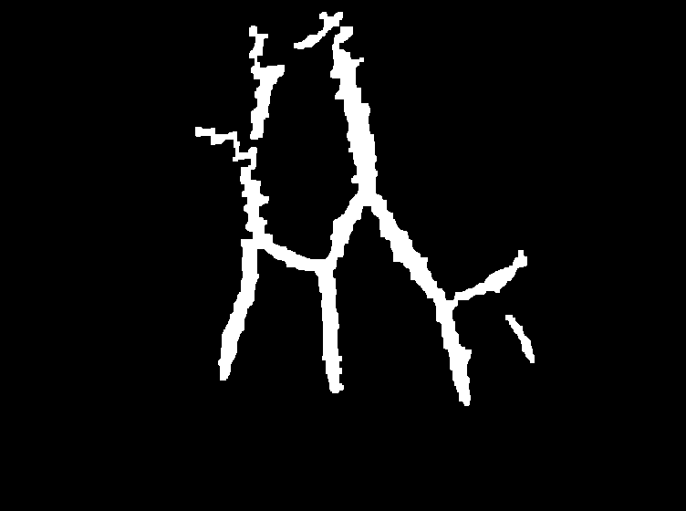
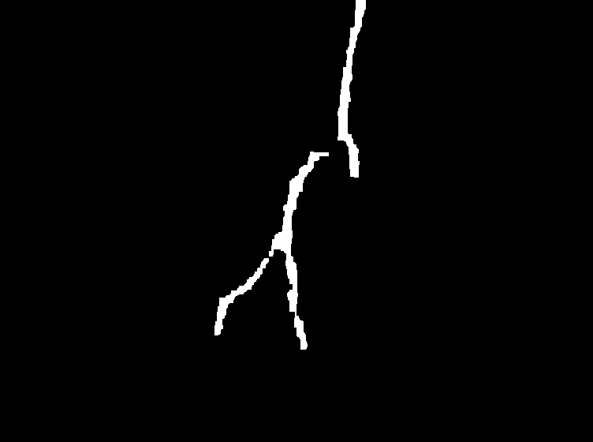

# Dorsal Vein Detection System

A computer vision pipeline for detecting and segmenting dorsal hand veins from NIR images using image processing techniques.

## Overview

This project applies classical image processing methods — CLAHE enhancement, Frangi vessel filtering, and morphological operations — to extract vein patterns from dorsal hand images.

## Pipeline

1. **Preprocessing** (`Processing.py`) — CLAHE contrast enhancement, Frangi filter for vessel detection, adaptive thresholding, morphological cleanup
2. **Training** (`train.py`) — Deep learning model (U-Net style) for vein segmentation using PyTorch
3. **Evaluation** (`evaluate_db2.py`) — Evaluates segmentation performance on DB2

## Dataset

This project uses the **Dorsal Hand Veins Dataset** by Wilches et al.

- Source: [https://github.com/wilchesf/dorsalhandveins](https://github.com/wilchesf/dorsalhandveins)

Clone the dataset and place it in a `Data/` folder at the root of this project:

```bash
git clone https://github.com/wilchesf/dorsalhandveins.git Data
```

## Output

### DB1

| | | | | |
|:---:|:---:|:---:|:---:|:---:|
|  |  |  |  |  |

### DB2

| | | | | |
|:---:|:---:|:---:|:---:|:---:|
|  |  |  |  |  |

## Requirements

```bash
pip install numpy opencv-python scikit-image torch
```

## Usage

```bash
# Run vein detection pipeline
python Processing.py

# Evaluate on DB2
python evaluate_db2.py
```
